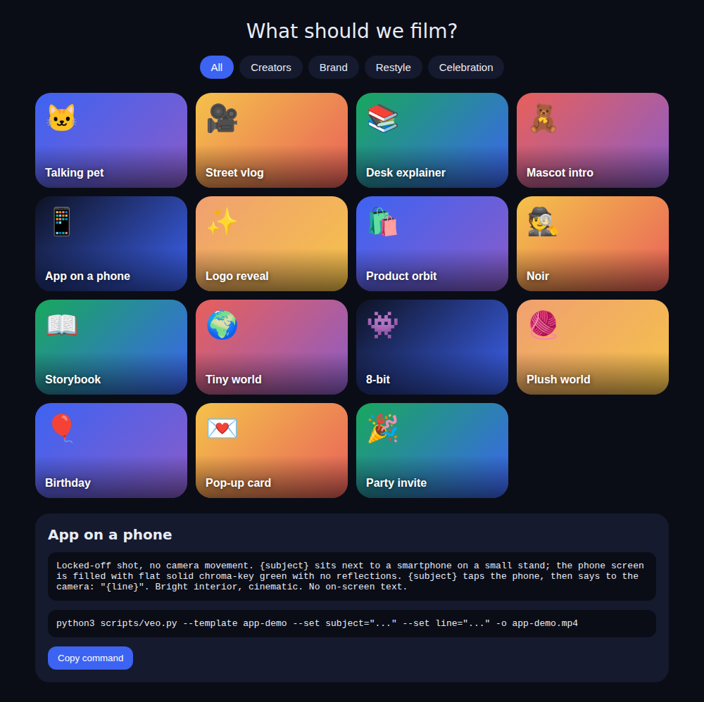

# Gemini Veo Studio Skill for Claude

**Make AI videos with Google Veo 3.1 from Claude.** An open-source Claude Agent Skill for text-to-video, image-to-video and character-consistent clips with native audio, through the official Gemini API.

This **Agent Skill** lets Claude (Claude Code or the Claude app) make short videos with **Google Veo** through the official Gemini API, from the first idea to a finished MP4.

- **Starter panel:** a gallery of video templates (Creators, Brand, Restyle, Celebration), like the Videos page in the Gemini app.
- **Generation:** Claude writes the shot list, generates each clip with Veo (with native audio), and checks it.
- **Finishing:** Claude joins the shots, keeps Veo's voice, can swap a stand-in for your real mascot, puts a real app UI on a phone, cleans garbled text and adds an end card.

> Not affiliated with Google or Anthropic. You use your own Gemini API key and pay Google for what you generate.


## What using it looks like

**Once:** get a Gemini API key, turn on billing, and add the skill to Claude (sections 1 and 2 below, about 10 minutes).

**Every video:** you just talk to Claude. A typical session:

> **You:** Make a 20-second video of my cat introducing our app. Here's our mascot: mascot.png
>
> **Claude:** *(opens the template panel)* Which style? Creators · Brand · Restyle · Celebration
>
> **You:** Brand → App on a phone
>
> **Claude:** Here's the plan: 4 shots × 8 s. (1) mascot waves at a desk, (2) cat on a sofa with a phone, (3) paw taps the phone, (4) close-up line. About $3 with Veo 3.1 Fast. Go?
>
> **You:** Go.
>
> **Claude:** *(generates shot 1… 2… 3… 4, about 1 to 6 min each, checks each one and redoes a bad one)* Joining them, keeping the voice, putting your app's screens on the phone, adding the end card… Here's `video.mp4` (1080p, 22 s).



You never run a command yourself unless you want to; Claude runs the scripts in your terminal (Claude Code) or on your linked computer.

---

## 1. Get a Gemini API key

1. Go to **https://aistudio.google.com/apikey** and sign in with your Google account.
2. Click **Create API key**. If it asks for a Google Cloud project, create a new one or pick an existing one.
3. Copy the key (it starts with `AIza`).
4. **Turn on billing for that project.** Veo is **not** on the Gemini API free tier. In AI Studio, open *Set up billing* for the project and add a payment method.
5. Recommended: in Google Cloud Billing, add a **budget alert** (for example $10) so a test can't run up costs.

Keep the key secret. Never paste it into a chat, commit it to a repo or show it in a screenshot. If it leaks, delete it in AI Studio and create a new one.

### What it costs
Veo through the API is billed per second of generated video. These are the prices last seen on Google's pricing page in September 2026; check https://ai.google.dev/gemini-api/docs/pricing for current numbers.

| Model | 720p per second | One 8 s clip |
|---|---|---|
| Veo 3.1 Lite | ~$0.05 | ~$0.40 |
| Veo 3.1 Fast | ~$0.10 | ~$0.80 |
| Veo 3.1 | ~$0.40 | ~$3.20 |

A 20 to 40 s video is 3 to 5 shots, plus a retry or two. Clips blocked by Google's safety filters are not billed.

The script uses `veo-3.1-generate-preview` by default. To use a cheaper model, set `VEO_MODEL` to its model ID from Google's Veo docs.

---

## 2. Install

Requires Python 3.9+ and ffmpeg (for finishing).

```bash
git clone https://github.com/sabaazdn73/gemini-veo-studio-skill-for-claude.git gemini-veo-studio
cd gemini-veo-studio
pip install google-genai
# macOS: brew install ffmpeg      Linux: sudo apt install ffmpeg
```

Put the key in your shell (and in `~/.zshrc` or `~/.bashrc` to keep it):

```bash
export GEMINI_API_KEY="AIza..."
```

Add the skill to Claude:
- **Claude Code:** copy the folder to `~/.claude/skills/gemini-veo-studio/`.
- **Claude app:** zip the folder and upload it under **Settings → Capabilities → Skills**. Claude needs a shell that can reach Google, so use it in Claude Code or with your computer linked.

Check it works (this is free):

```bash
python3 scripts/veo.py --list
python3 scripts/veo.py --template talking-pet --set subject="a cream cat" --set line="Hi!" --dry-run
```

---

## 3. Make a video with Claude (full flow)

Ask Claude something like:

> Make a 20-second video of my cat explaining our app. Use our mascot (mascot.png) in the first shot and show the app on a phone.

What happens next:

1. **Panel.** Claude opens the template gallery (`panel.html`) and asks which category and template you want. You can also just describe your own idea.
2. **Shot list.** Claude writes 3 to 5 shots (8 s each) with camera, light, dialogue and sound. It shows you the list **before** spending anything. You approve or edit it.
3. **Generate.** Claude runs `scripts/veo.py` once per shot. Each takes about 1 to 6 minutes. It looks at every clip and regenerates bad ones (each retry costs).
4. **Finish.** Claude joins the shots, keeps Veo's audio, and adds what you asked for, following `references/post-production.md`:
   - your real mascot in place of a stand-in, with the mouth moving to the voice;
   - your app's screens on a green-screen phone;
   - clean captions;
   - an end card.
5. **Deliver.** You get the final 1080p MP4.

---

## 4. Use the scripts yourself

```bash
python3 scripts/panel.py                    # writes panel.html, the template gallery
python3 scripts/panel.py --thumbs           # also makes a thumbnail per template (billed image calls)

python3 scripts/veo.py "A cream cat waves at the camera and says: \"Hi!\"" -o cat.mp4
python3 scripts/veo.py --template noir --set subject="a detective cat" --set place="Lisbon" --set line="It was raining." -o noir.mp4
python3 scripts/veo.py "The mascot waves" --ref mascot.png -o intro.mp4      # keep a character (up to 3 refs, 8 s)
python3 scripts/veo.py "Logo assembles" --first logo.png --last end.png -o logo.mp4
python3 scripts/veo.py "Then it jumps onto the sofa" --extend cat.json -o cat2.mp4   # continue a clip
```

Options: `--aspect 16:9|9:16`, `--seconds 4|6|8`, `--resolution 720p|1080p|4k` (1080p and 4k need 8 s), `--negative`, `--seed`, `--dry-run`.

Each run saves the `.mp4` and a `.json` with the request and the video's URI. Extension needs that URI, and Google keeps generated videos for 2 days.

## 5. Limits worth knowing
- One call makes one 4 to 8 s clip. Longer videos are several shots joined together, or extended in 7 s steps.
- Google's safety filters block real public figures, copyrighted characters, violence and sexual content. In the EU, UK, Switzerland and MENA only adults can be generated.
- Veo writes on-screen text badly, so add text in the edit.
- Results vary; plan for a retry or two per shot.
- Videos carry Google's SynthID watermark.

## Add your own templates
Edit `assets/templates.json`: each template has an `id`, `category`, `title`, `emoji`, what it `needs`, a default `aspect` and a `prompt` with `{placeholders}`.

## Keywords
Claude skill, Claude Code skill, Agent Skills, Anthropic Claude, Google Veo 3.1, Gemini API, Veo API, AI video generator, text-to-video, image-to-video, AI video with audio, mascot video, product demo video, open source.

## License
MIT. See [LICENSE](LICENSE).
